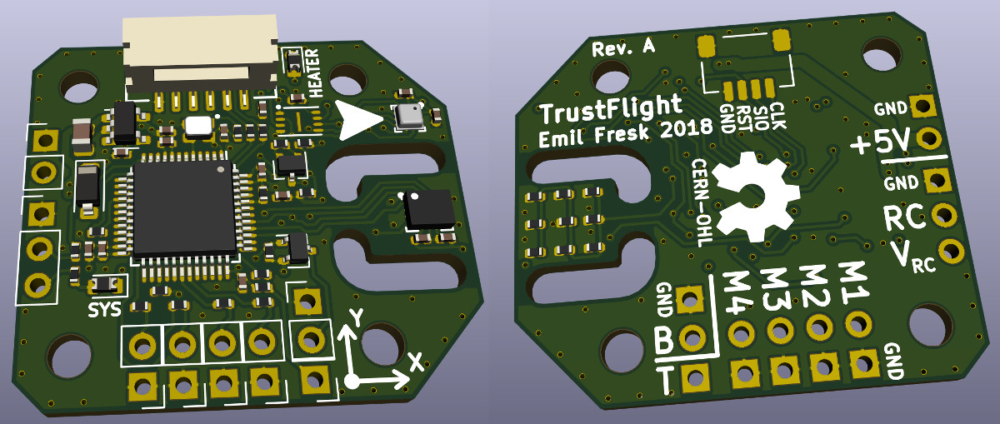

# ThrustFlight hardware reference design

A small and simple flight controller to be used with the  [trustflight firmware](https://github.com/korken89/trustflight_firmware) flight controller firmware, which is focusing on safety by using the Rust programming language.

## License

The hardware is OSHW using the Cern-OHL license.

## Images

